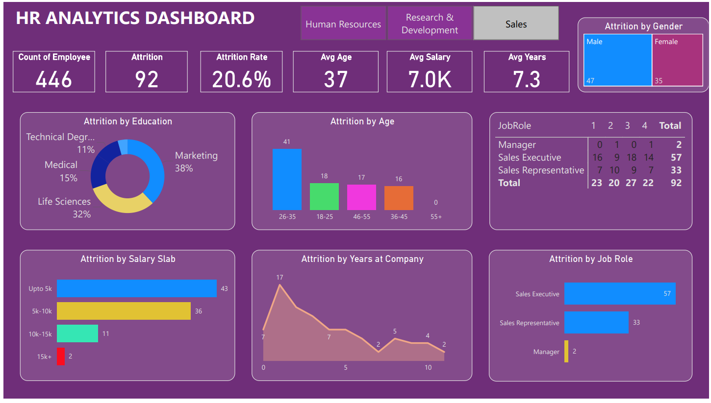

# 💼 HR Analytics Dashboard — Power BI Project

This repository contains a Power BI project focused on HR analytics and employee attrition analysis. The dashboard provides actionable insights into employee demographics, attrition trends, satisfaction levels, and performance metrics to support HR decision-making and workforce planning.

---

## 📊 Dashboard Features

The HR Analytics Dashboard helps answer key business questions, such as:

- What are the main factors influencing employee attrition?
- Which departments have the highest turnover?
- How does job satisfaction vary by role, gender, and department?
- What is the age distribution and gender ratio of employees?
- How does monthly income vary across job roles and education levels?

---

## 📁 Dataset

The dashboard is built using the **IBM HR Analytics Employee Attrition & Performance** dataset from [Dataset](https://github.com/ShariaAfrin/HR-Analytics-Dashboard/blob/main/HR_Analytics.csv).

**Dataset Features Include:**
- Age, Gender, Education, Job Role
- Monthly Income, Job Level, Department
- Job Satisfaction, Work-Life Balance
- Attrition (Yes/No), OverTime, Years at Company

---

## 🛠 Tools & Technologies

- Microsoft Power BI (Desktop)
- DAX (Data Analysis Expressions)
- Power Query (M Language)
- Data Modeling (Star schema)

---

## 📌 Key Visuals Used

- Bar Charts & Column Charts
- Pie & Donut Charts
- Stacked Area Charts
- KPI Cards
- Slicers for interactive filtering

---

## 📸 Dashboard Preview

 <!-- Optional: Include screenshot if available -->

---

## 🚀 How to Use

1. Download the `.pbix` file from this repository.
2. Open it in Power BI Desktop.
3. If using a custom dataset, go to **Home > Transform Data** to load your own.
4. Refresh the data and explore insights interactively.

---

## ✅ Use Cases

- HR reporting and presentations
- Executive workforce insights
- Recruitment and retention strategy
- DEI (Diversity, Equity, and Inclusion) analysis

---

## 📚 License

This project is open-source and available under the [MIT License](LICENSE).

---

## 🤝 Contributing

Feel free to fork this repository and suggest improvements via pull requests or issues.

---

